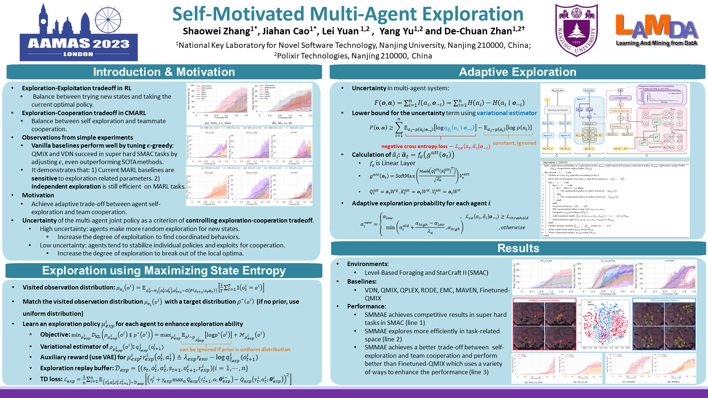

# Self-Motivated Multi-Agent Exploration (SMMAE)

*Self-Motivated Multi-Agent Exploration* (**SMMAE**) is a Full Paper in **AAMAS 2023**. \[[paper](https://www.southampton.ac.uk/~eg/AAMAS2023/pdfs/p476.pdf)\]

This is the code of **SMMAE** , which is based on [PyMARL](https://github.com/oxwhirl/pymarl) framework and [SMAC](https://github.com/oxwhirl/smac) environment.

In our experiments, SMAC uses SC2.4.6.2.69232.

## AAMAS 2023 Poster



## Installation instructions

Set up StarCraft II and SMAC:
```shell
bash install_sc2.sh
```

This will download SC2 into the 3rdparty folder and copy the maps necessary to run over.

The requirements.txt file can be used to install the necessary packages into a virtual environment (not recomended).

## Run an experiment 

```shell
python3 src/main.py --config=smmae_qmix --env-config=sc2 with env_args.map_name=MMM2
```

The config files act as defaults for an algorithm or environment. 

They are all located in `src/config`.
`--config` refers to the config files in `src/config/algs`
`--env-config` refers to the config files in `src/config/envs`


All results will be stored in the `results` folder.


## License

Code licensed under the Apache License v2.0
